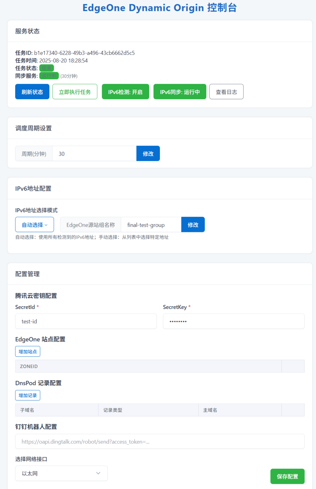

# EdgeOne Dynamic Origin


EdgeOne 是腾讯云的边缘安全加速平台。该脚本为其提供动态更新源站组 IP 的功能。
此功能特别适用于那些 IP 地址可能会变化的源站，确保 CDN 始终能够正确地获取最新的内容。比如仅有动态 IPV6 地址的服务器，
也能够长期稳定部署WEB服务，而不必使用 frp / ngork 等内网端口转发工具。

注意，若要使用该脚本，在 EdgeOne 中的加速域名必须使用源站组配置源站。

## 📖 项目信息

本项目基于 [EdgeOneDynamicOrigin](https://github.com/sqkkyzx/EdgeOneDynamicOrigin) 进行了全面的升级和改进。原项目为腾讯云 EdgeOne 边缘安全加速平台提供动态更新源站组 IP 的功能，特别适用于动态 IPv6 地址的源站管理。

## 🚀 主要更新特性

### IPv6 地址管理增强
- **增加IPV6检测开关**: 支持自由开启或关闭IPV6连通性检测
- **多种选择模式**: 支持手动选择和自动检测IPv6地址
- **增加手动选择**: 支持手动单选或多选IPV6地址
- **多网卡支持**: 支持指定网络接口获取IPv6地
- **持久化配置**: 保存配置和日志文件本地

### Web UI 界面增强
- **自定义命名**: 支持为源站组设置自定义名称
- **服务控制**: 新增启动/停止服务按钮
- **日志管理**: 实时日志查看和清空功能
- **状态监控**: 实时显示服务运行状态

### 使用方法

#### windows
1. 安装 `pip install eodo`
2. 运行 `eodo -p 54321`以启动。 -p 54321 表示 web 管理界面监听端口为 54321。
3. 在 `http://localhost:54321` 中配置必要的配置项。

#### ubuntu
1. 安装 `pip3 install eodo -U --break-system-packages`
2. 运行 `export PATH="$HOME/.local/bin:$PATH" && source ~/.bashrc` 将 ~/.local/bin 加入 PATH
3. 运行 `eodo -p 54321`以启动。  -p 54321 表示 web 管理界面监听端口为 54321。
4. 在 `http://localhost:54321` 中配置必要的配置项。

#### Docker (推荐)

##### 使用预构建镜像
```bash
# 拉取最新镜像
docker pull mayflydestiny/edgeone-dogroup:latest

# 运行容器
docker run -d \
  --name eodo \
  --network=host \
  -v /path/to/config:/eodo \
  mayflydestiny/edgeone-dogroup:latest
```

##### 使用 Docker Compose (推荐)
```bash
# 下载 docker-compose.yml
wget https://raw.githubusercontent.com/MayflyDestiny/EdgeOne-DOGroup/refs/heads/main/docker-compose.yml

# 启动服务
docker-compose up -d
```

##### 手动构建
```bash
# 构建镜像
docker build -t eodo:latest .

# 运行容器
docker run -d --network=host --name eodo eodo:latest
```

### 🚀 快速开始

1. **Docker 部署**（推荐）:
   ```bash
   docker run -d --name eodo --network=host mayflydestiny/edgeone-dogroup:latest
   ```

2. **访问 Web 界面**: http://localhost:54321

3. **配置腾讯云凭证**:
   - SecretId 和 SecretKey
   - EdgeOne Zone ID
   - DNSPod 记录配置（可选）

4. **设置 IPv6 管理**:
   - 选择 IPv6 获取模式
   - 配置检查间隔
   - 启用连通性验证

5. **启动服务**: 点击"立即执行任务"开始自动更新

### 浏览器访问 `http://localhost:54321` 进行配置。

### WEB 界面


### 🔧 高级配置

#### 环境变量
- `EODO_PORT`: Web 界面端口 (默认: 54321)
- `EODO_CONFIG_PATH`: 配置文件路径 (默认: /eodo/config.yaml)
- `EODO_LOG_LEVEL`: 日志级别 (DEBUG/INFO/WARNING/ERROR)

#### 配置文件
配置文件支持以下主要选项：
- `IPv6SelectMode`: IPv6选择模式 (manual/auto)
- `IntervalMin`: 检查间隔时间（分钟）
- `IPv6ValidityCheck`: 是否启用IPv6连通性检查
- `SelectIface`: 指定网络接口

### 📚 文档说明

- [升级功能详细说明](UPGRADE_FEATURES.md) - 查看所有新功能和改进的详细说明
- [GitHub Actions 构建指南](GITHUB_ACTIONS_GUIDE.md) - 了解自动化构建和部署流程

### 🔒 安全说明

- 所有敏感配置信息都存储在本地配置文件中
- 支持配置文件加密存储
- 建议使用具有最小权限的腾讯云子账号
- 定期更新到最新版本以获得安全修复

### 📈 监控和维护

- **日志查看**: Web 界面提供实时日志查看功能
- **状态监控**: 实时显示服务运行状态和最后更新时间
- **健康检查**: 自动检测服务健康状态
- **持久化运行**: 支持 systemd、nssm 等服务管理工具

### 🤝 贡献指南

欢迎提交 Issue 和 Pull Request！

- 提交 Bug 报告时请包含详细的错误信息和复现步骤
- 新功能建议请先创建 Issue 讨论
- 代码贡献请确保通过所有测试和代码质量检查

### 📄 许可证

MIT License - 详见 [LICENSE](LICENSE) 文件
